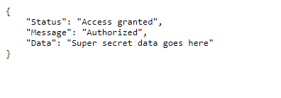
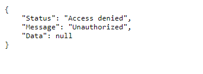

# Flask-API-Database
Creating a Flask API to display data from a database, and a front end program using python to generate, hash and manage API key access to the flask application. 

# What is the point of this project?
This project demonstrates the connectivity of a MySQL database with a Flask API and secure API key generation, as well as securely hashing and checking API keys given to the Flask program. 

# What I learned
* Creating a REST API using Flask and Python3
* Securely generating, hashing and storing API keys
* Connectivity between Flask API and MySQL database

# Example Responses

